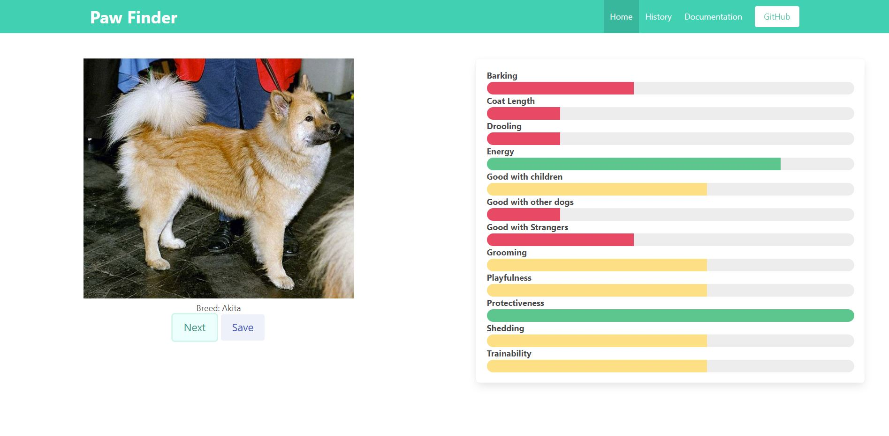

# paw-finder

## User Story 

As a person who is looking for a dog, I want to look at dog pictures and choose a dog breed I like. Based on my choice, I want to find the closest dogs for adoption of that breed. 

## Installation

The following tools were used for the development and testing of this project. Web Browser (Google Chrome preferred) Code development IDE (Microsoft VS Code)

## Usage 

Paw-Finder allows a user to select attributes of a dog that are important to their lifestyle, scroll through various types of dog breeds, save dog breeds that they like, and eventually find their favorite dog breed.

Open HTML and CSS code using Code development IDE. Open HTML using Web Browser.

## Link

Link to Website: https://seangshin.github.io/paw-finder/

## Credits

Development team: Sean Shin, Cinthia Pruitt, Tyler Moore, Jared Williams. Georgia Tech Coding Bootcamp instructors, TA's, and other faculty. Third party APIs Bootstrap, jQuery, Moment.js. Server side API Dog API (https://dog.ceo/dog-api/) and API Ninjas (https://api-ninjas.com/api/dogs).

## License

Not applicable
